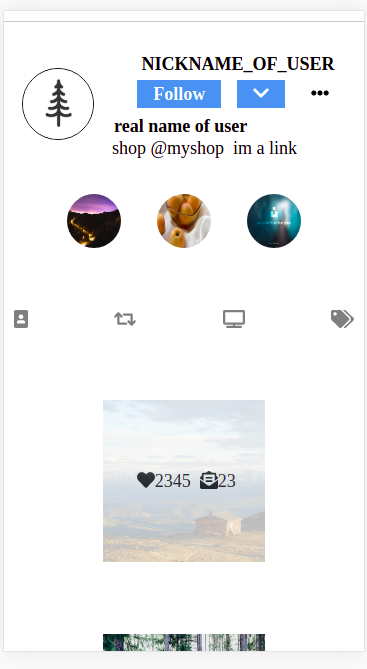

  

  <strong> toDoList </strong>
I created my own version of an Instagram profile-page using React and SASS.
<!-- examples of useState useEffect and useRef :
 -->
     
    <a href="https://github.com/AngelosPa/toDoList-ReactVersion/tree/main/mytodolist"><strong>Explore the files »</strong></a>
     
     
    <a href="https://angelospa.github.io/toDoList-ReactVersion/">View Demo</a>
    ·
    <a href="https://github.com/AngelosPa/Instagram-Profilepageclone/blob/main/src/components/Newpost.js">you can see examples of { useState, useEffect } Hooks</a>
    ·
    <a href="https://github.com/github_username/repo_name/issues">Request Feature</a>
  

