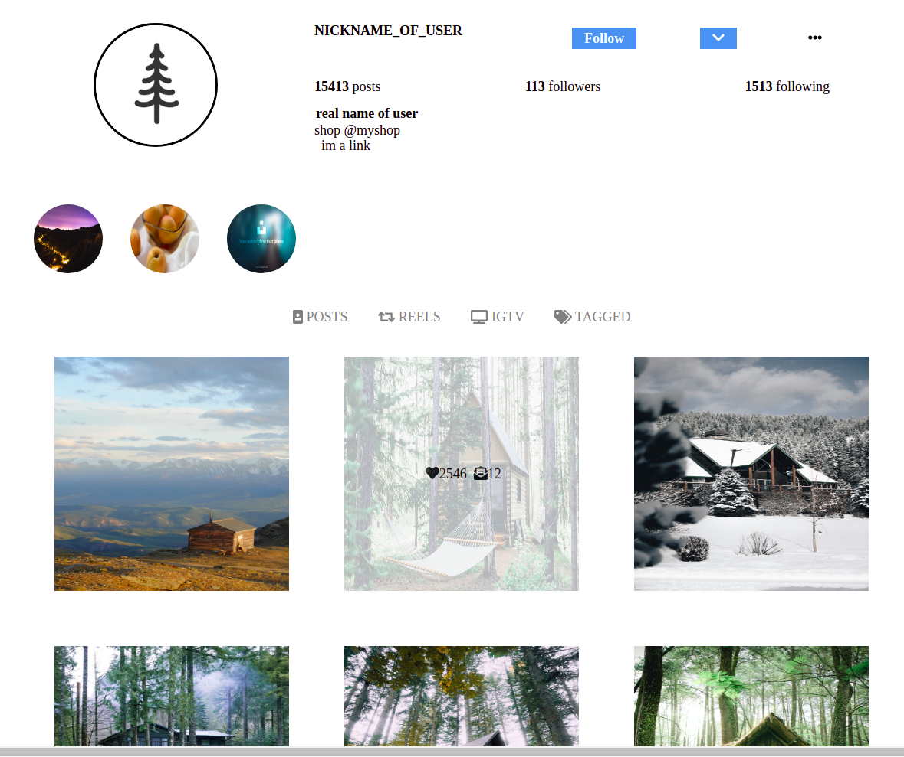

I created my own version of an Instagram profile-page using React and SASS.
[Here](https://github.com/AngelosPa/Instagram-Profilepageclone/blob/main/src/components/Newpost.js)
you can see examples of { useState, useEffect } Hooks

